# CST8921-Lab2_CloudSecurity

- Student Name: Jingjing Duan
- Student Number: 041159829
- Date: June 2026


### Task 1: Create an Azure Policy – Allowed Locations

**Purpose:** Ensure resources can only be deployed in an approved region.

**Steps:**
1. Sign in to the **Azure Portal**
2. Search for **Policy**
3. Select **Definitions**

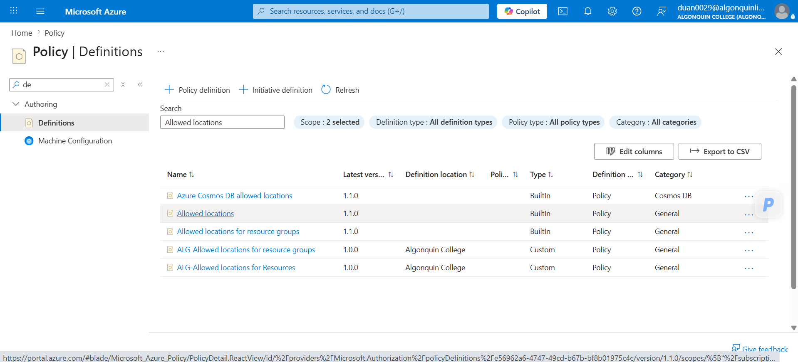


4. Search for the built-in policy: `Allowed locations`
5. Select the policy → Click **Assign**

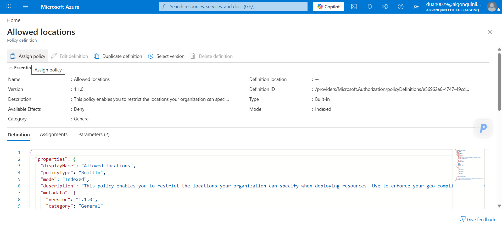

6. Configure:
   - **Scope:** Subscription
   - **Allowed locations:** Canada Central
7. Click **Review + Create**

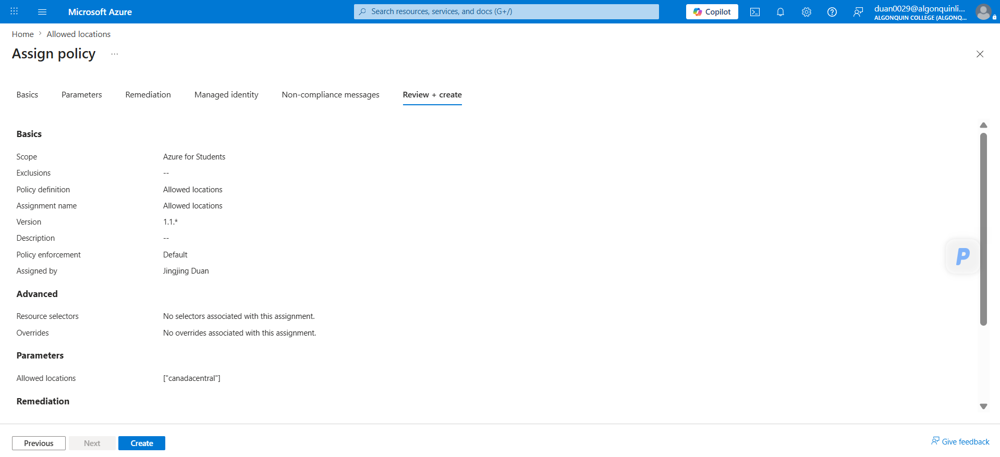
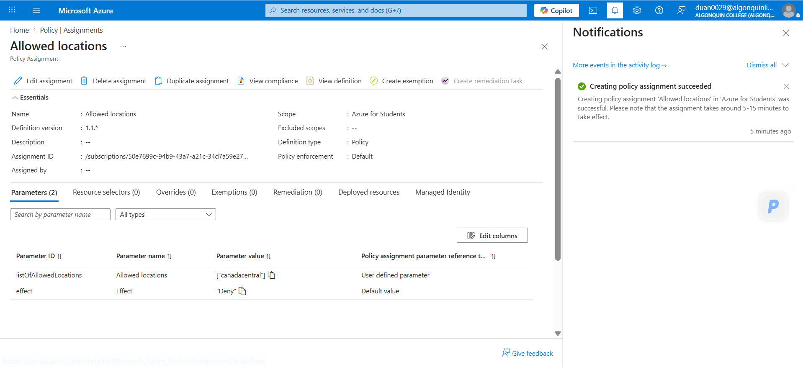


**Validation:**
- Attempt to create a storeage avccout in a different region (East US2)
- Confirm deployment fails

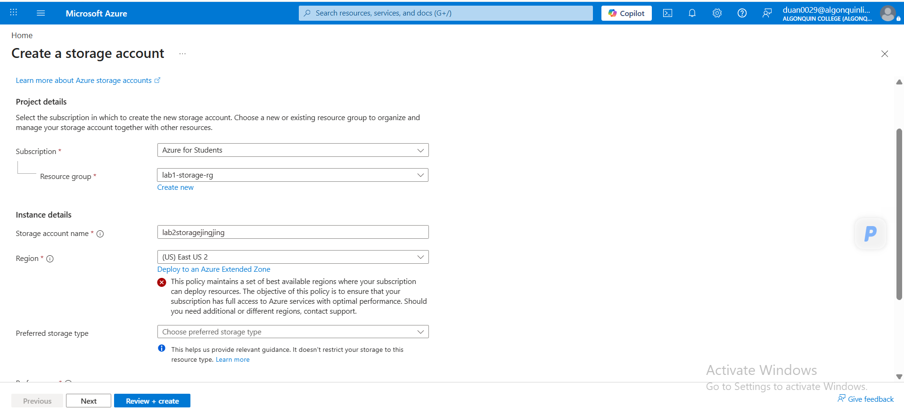


### Task 2: Create a Virtual Network (Canada Central)

**Purpose:** Establish a secure network boundary.

**Steps:**
1. Search for **Virtual Networks**
2. Select **Create**
3. Configure:
   - **Region:** Canada Central
   - **Address space:** `10.0.0.0/16`
4. Do not add subnets yet
5. Click **Review + Create**

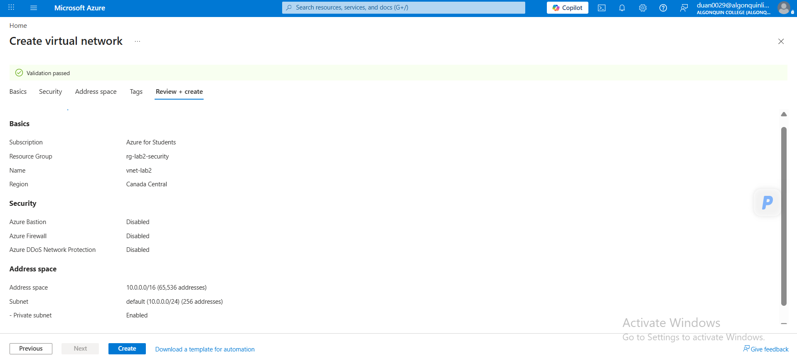
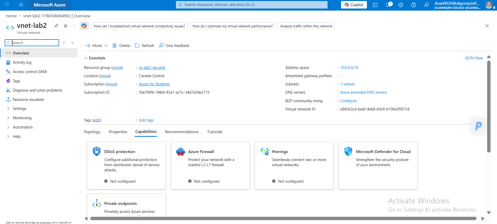

---

### Task 3: Create Subnets & Enable Storage Service Endpoint

**Purpose:** Ensure storage traffic stays within Azure's backbone network.

**Subnets to Create:**

| Subnet Name    | Address Range  | Purpose          |
|----------------|----------------|------------------|
| private-subnet | 10.0.1.0/24    | Secure access    |
| public-subnet  | 10.0.2.0/24    | Internet-facing  |

**Steps:**
1. Open the **Virtual Network**
2. Go to **Subnets**
3. Add `private-subnet`:
   - Enable **Service Endpoint**
   - Service: `Microsoft.Storage`

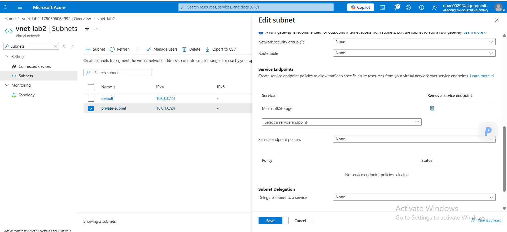

4. Add `public-subnet` (no service endpoint)

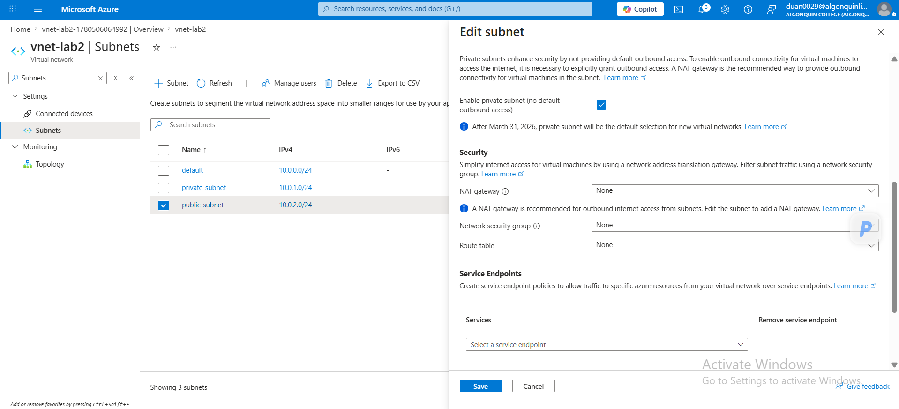

---

### Task 4: Create Network Security Group (NSG)

**Purpose:** Control inbound and outbound network traffic.

**Steps:**
1. Search for **Network Security Groups**
2. Create NSG in **Canada Central**
3. Associate NSG to `private-subnet`

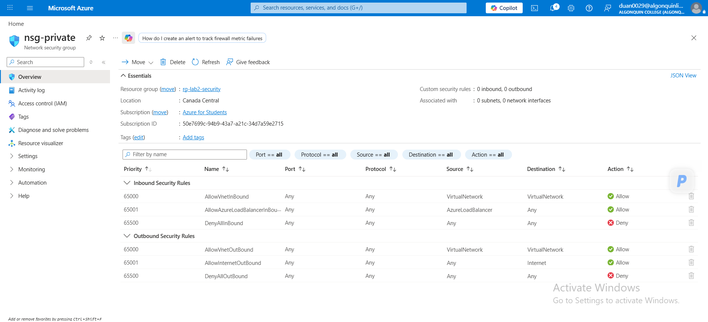

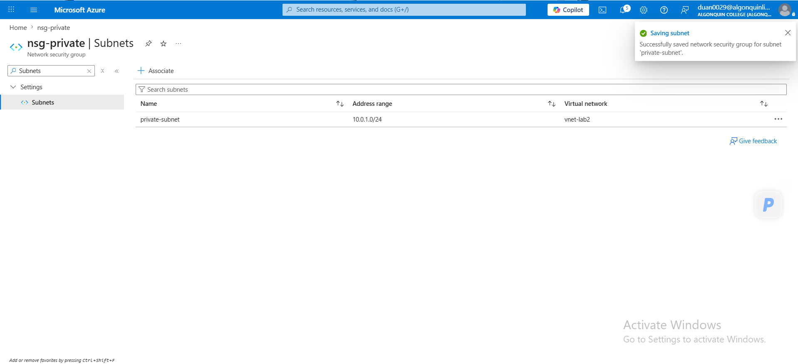

---

### Task 5: Configure NSG Rules (Private Subnet)

**Outbound Rule – Allow Azure Storage**

| Setting       | Value           |
|---------------|-----------------|
| Destination   | Service Tag     |
| Service Tag   | Storage         |
| Action        | Allow           |
| Priority      | 100             |

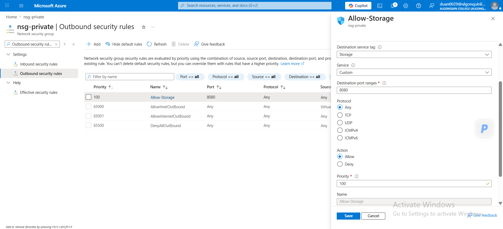

**Outbound Rule – Deny Internet Access**

| Setting       | Value           |
|---------------|-----------------|
| Destination   | Internet        |
| Action        | Deny            |
| Priority      | 200             |

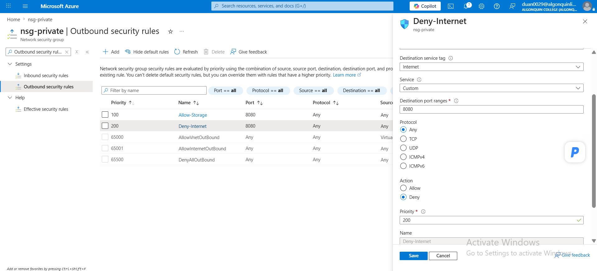

---

### Task 6: Configure NSG for Public Subnet (RDP Access)

**Inbound Rule – Allow RDP**

| Setting   | Value  |
|-----------|--------|
| Source    | Any    |
| Port      | 3389   |
| Protocol  | TCP    |

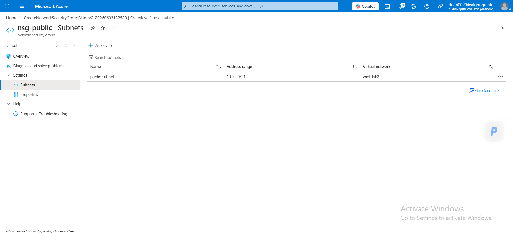

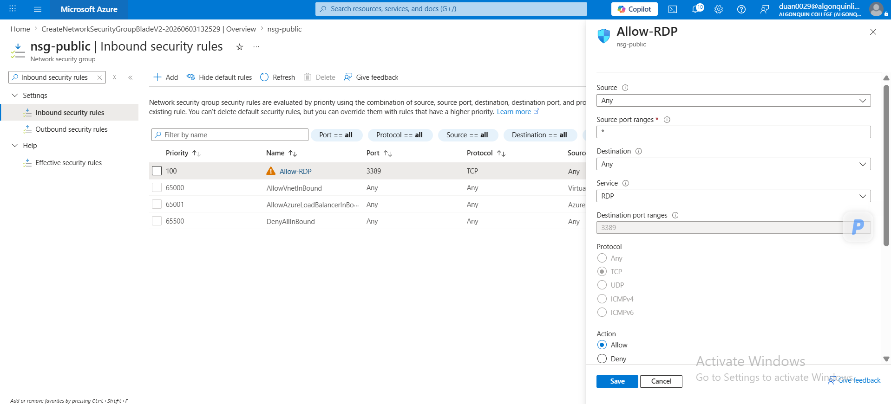

---

### Task 7: Create a Storage Account with File Share

**Purpose:** Secure storage access to only approved subnets.

**Steps:**
1. Create a **Storage Account**
   - Region: Canada Central
2. Go to **Networking**
3. Set:
   - **Network access:** Enabled from selected networks
   - Allow access only from `private-subnet`
4. Create an **Azure File Share**

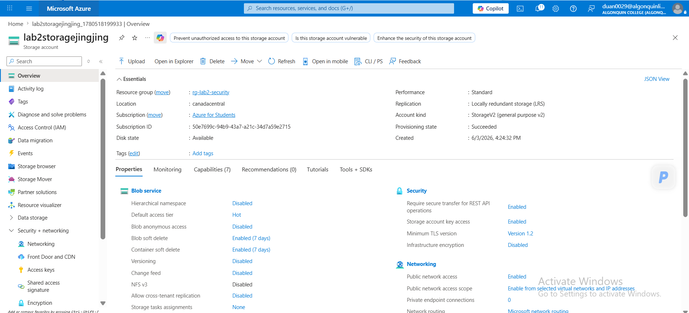
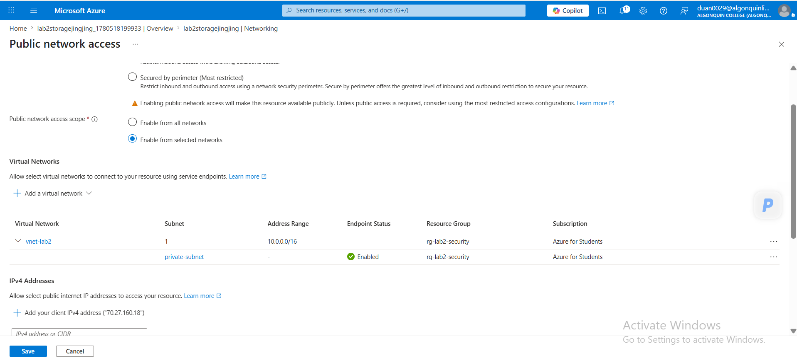
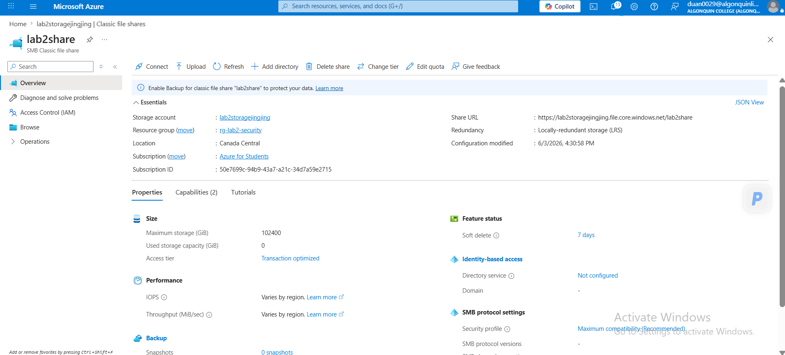

---

### Task 8: Deploy Virtual Machines

Deploy two Windows VMs:

| VM Name    | Subnet         |
|------------|----------------|
| vm-private | private-subnet |
| vm-public  | public-subnet  |

- Enable **Azure Bastion**
- Use the **same credentials** for both VMs
  
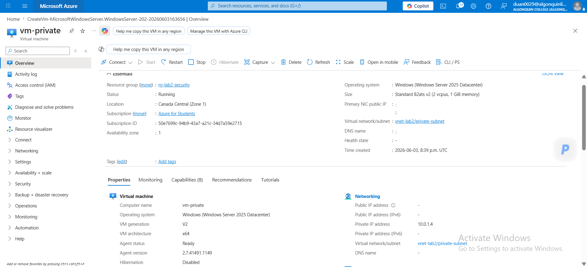
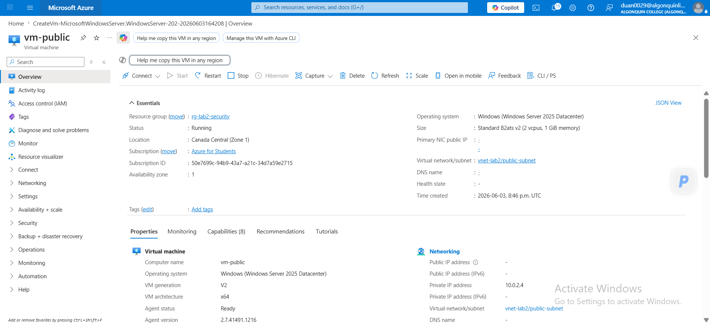

---

### Task 9: Test Storage Access from Private Subnet (Allowed)

1. Connect to `vm-private` using **Bastion**
2. Open **Windows PowerShell**
3. Run the following command:

```powershell
$key = @{
    String = "<storage-account-key>"
}
$acctKey = ConvertTo-SecureString @key -AsPlainText -Force

$cred = @{
    ArgumentList = "Azure\<storage-account-name>", $acctKey
}
$credential = New-Object System.Management.Automation.PSCredential @cred

$map = @{
    Name       = "Z"
    PSProvider = "FileSystem"
    Root       = "\\<storage-account-name>.file.core.windows.net\file-share"
    Credential = $credential
}
New-PSDrive @map
```

**Expected Result:** Azure file share successfully mapped to drive `Z:`

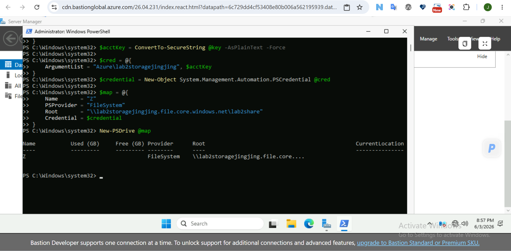

### Task 10: Test Storage Access from Public Subnet (Denied)

1. Connect to `vm-public` using Bastion
2. Repeat the same PowerShell command from Task 9

**Expected Result:** Access denied error

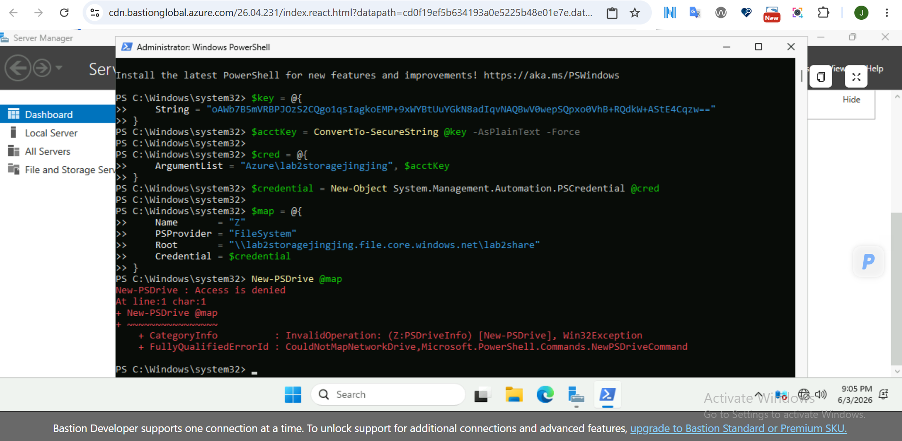

---

## Security Analysis and observations

This lab demonstrated several important Azure security features, including Azure Policy, Virtual Networks, Network Security Groups (NSGs), and Storage Account access control.

An Azure Policy was used to restrict resource deployment to the Canada Central region. This helps organizations ensure that resources are created only in approved locations and supports compliance requirements.

A Virtual Network was created with two subnets: private-subnet and public-subnet. Separating resources into different subnets improves security by limiting network access between resources.

Network Security Groups were configured to control network traffic. The private subnet was allowed to access Azure Storage services while Internet access was restricted. The public subnet was configured to allow RDP access for management and testing purposes.

The Storage Account was configured to allow access only from the private-subnet. During testing, the virtual machine in the private subnet successfully accessed the Azure File Share, while the virtual machine in the public subnet was unable to connect.

The results confirmed that the network security controls worked as expected. By combining Azure Policy, subnet isolation, NSGs, and Storage Account networking rules, access to cloud resources was effectively controlled and protected.


---

## Validation Summary

| Scenario                                  | Expected Outcome |
|-------------------------------------------|------------------|
| Resource creation outside Canada Central  | Blocked          |
| Storage access from private subnet        | Allowed          |
| Storage access from public subnet         | Denied           |

---

## Cleanup (Mandatory)

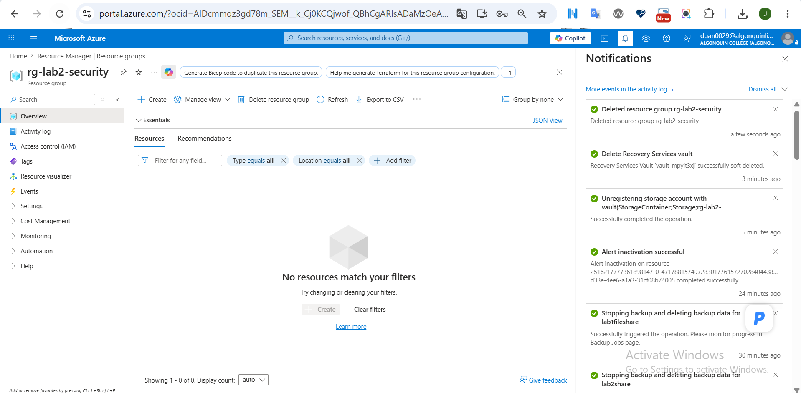

---


